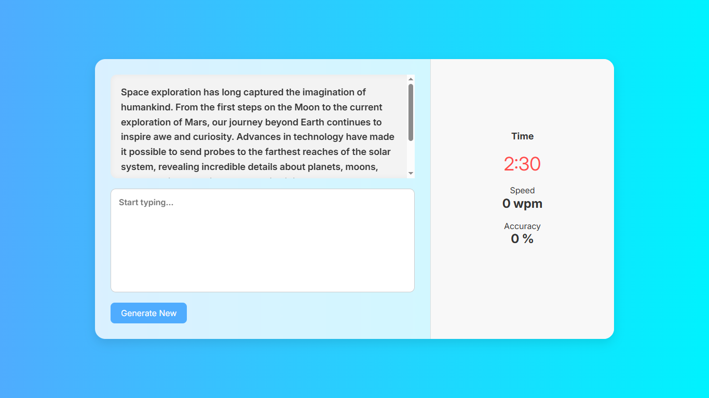

# ⌨️ Typing Tester - Speed & Accuracy Checker

A modern and interactive **Typing Test Web App** that helps users improve their typing **speed (WPM)** and **accuracy (%)** in a fun and easy way.

This app randomly displays a paragraph for the user to type, tracks typing in real-time, and calculates results once the timer ends.

 

--

## ✨ Features

- ⏱️ 2:30 minute countdown timer  
- 📜 Random paragraph generation  
- 🧠 Real-time typing detection  
- 🧮 Speed calculation in WPM  
- 🎯 Accuracy percentage based on typed vs original words  
- 🛡️ Disabled copy-paste for fair testing  
- 🔄 Reset & retest capability  
- 📱 Responsive design for mobile and desktop  
- 🎨 Modern UI with glassmorphism and gradient background  

---

## 🛠️ Tech Stack

- **HTML5**
- **CSS3** (modern UI + responsive design)
- **JavaScript** 

---


## ▶️ How to Run

1. **Clone the repository:**
   ```bash
   git clone https://github.com/C-W-Praduman/Typing-tester.git
   cd typing-tester


## 🙌 Author
Made with ❤️ by Praduman Gupta


